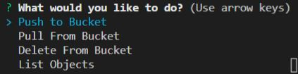

# S3 Bucket Shenanigans

A CLI tool for S3 bucket data exchange

Built With Nodejs 
<ul> 
<li>AWS SDK</li>
<li>inquirer</li>
<li>fs</li>
</ul>  
Clone repo  
Run npm i at root  
Create .env file in repo root and populate using the following template
  
{"accessKeyId":"enter_access_key_id",  "secretAccessKey":"enter_secret_access_key",  "bucket":"enter_bucket_name"}  

