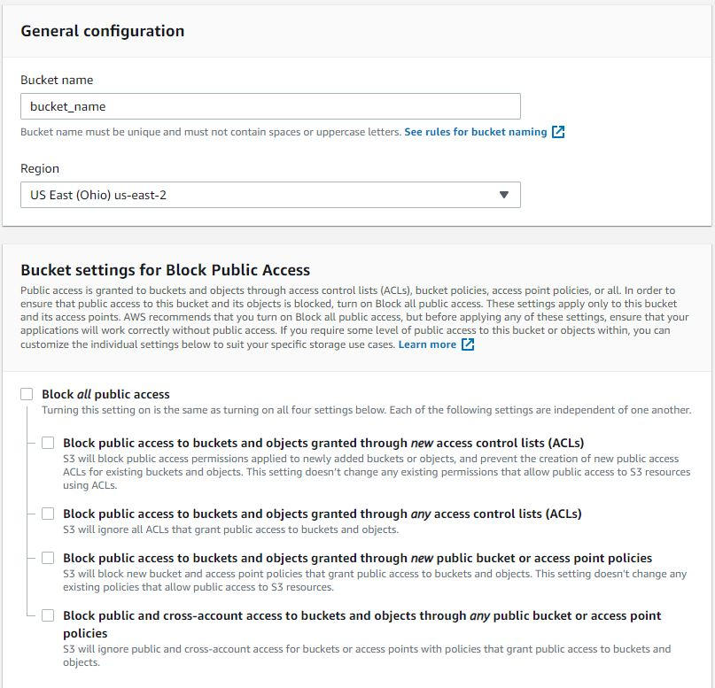
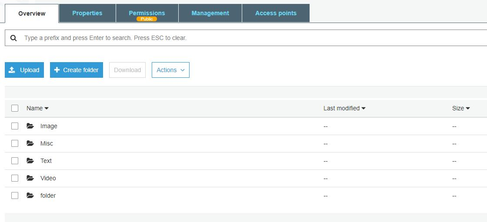
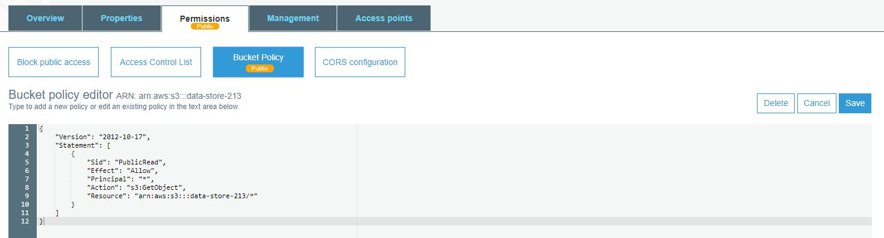

# S3 Bucket Shenanigans

A CLI tool for S3 bucket data exchange

Built With Nodejs 
<ul> 
<li>AWS SDK</li>
<li>inquirer</li>
<li>fs</li>
</ul>  
Visit <a href='https://console.aws.amazon.com/s3/'>https://console.aws.amazon.com/s3/</a> and create account or sign in  
Click "Create Bucket" button in top right corner  
Name your bucket, select your region, and be sure to unblock public access  

  
After Creating Bucket, select your bucket from the list  
This will take you to the bucket dashboard.  

 From here, click the "Permissions" tab
  

Select the "Bucket Policy" tab, and enter the following  
 {"Version": "2012-10-17", 
    "Statement": [ 
        {"Sid": "PublicRead", 
            "Effect": "Allow", 
            "Principal": "*", 
            "Action": "s3:GetObject", 
            "Resource": "arn:aws:s3:::bucket_name/*"
        }
    ]
}
  

Replace "bucket_name" with your bucket name in the "Resource" section of the Bucket Policy
  
Clone repo  
Run npm i at root  
Create .env file in repo root and populate using the following template
  
{"accessKeyId":"enter_access_key_id",  "secretAccessKey":"enter_secret_access_key",  "bucket":"enter_bucket_name", 
"region":"enter_region"}  
region example: "us-east-2"  

